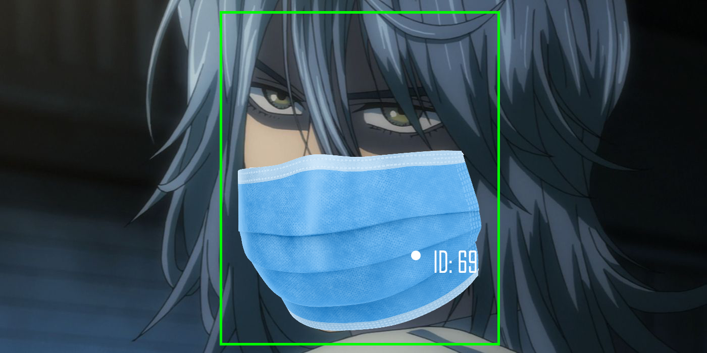
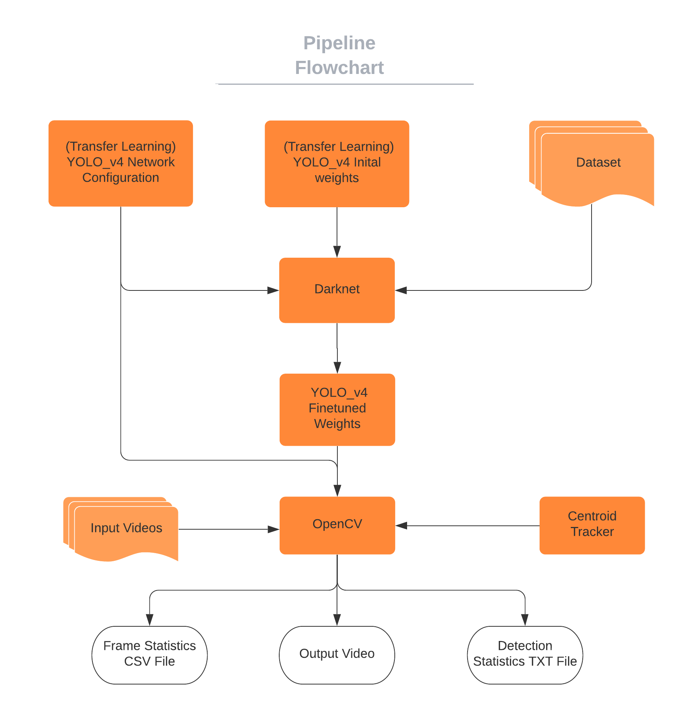

# Amai-Masuku

<p align="center">
   
</p>

### Megathon 2021 Submission

A system that detects faces with and without masks, tracks them and gives statistics. 

[Input Videos Link](https://iiitaphyd-my.sharepoint.com/:f:/g/personal/arihanth_srikar_research_iiit_ac_in/Es1LrdXYd7xMkDpbierdVfYBOEZ76tWqFTRCyHA2057GBg?e=Ehp2Br)

[Output Link](https://iiitaphyd-my.sharepoint.com/:f:/g/personal/sidharth_giri_students_iiit_ac_in/Erk7sF-f5L5BjbTO4Y84eMYB8V4Bz3w5pPpnd2lQ7orSIQ?e=Rvfu1N)

## Repository Structure

The repo has 2 main parts:

### Training

This folder has the data for training the YOLOV4 model on the dataset using Darknet. The [dataset](https://github.com/dkapur17/Amai-Masuku/tree/master/Training/dataset) consists of images collected from Google, Bing and Kaggle.

The images were annoted using [Labelimg Tool](https://github.com/tzutalin/labelImg). The resulting dataset was split into Train, Test and Validation sets.

We cloned Darknet (inside `Training/darknet`, which is empty for the interest of space, but can be cloned independently) and built it from source. This was used to train the model.

Darknet accepts a network configuration [`mask.cfg`](https://github.com/dkapur17/Amai-Masuku/blob/master/Training/mask.cfg), initial weights [`yolov4.conv.137`](https://github.com/AlexeyAB/darknet/releases/download/darknet_yolo_v3_optimal/yolov4.conv.137) (These are pretrained weights on the COCO Dataset) and dataset information [`mask.data`](https://github.com/dkapur17/Amai-Masuku/blob/master/Training/mask.data).

After training, Darknet saves the weights in the `backup` directory. The weights are too large to upload on github, so they've been uploaded on OneDrive. Here's the [link](https://iiitaphyd-my.sharepoint.com/:u:/g/personal/sidharth_giri_students_iiit_ac_in/EdcPoaXm0ZRImds55ekNgNoB2_MwChngyUsNQCN-D51eoA?e=fFzIf2).

#### Model details

- Data File = [mask.data](https://github.com/dkapur17/Amai-Masuku/blob/master/Training/mask.data) (contains training, testing and validation data)
- Cfg file = [mask.cfg](https://github.com/dkapur17/Amai-Masuku/blob/master/mask.cfg)
- Pretrained Weights for initialization= [yolov4.conv.137](https://github.com/AlexeyAB/darknet/releases/download/darknet_yolo_v3_optimal/yolov4.conv.137)
- Main Configs from mask.cfg:
  - learning_rate = 0.001
  - batch = 64
  - subdivisions = 64
  - steps = 4800, 5400
  - max_batches = 6000
  - approx epochs = (6000\*64)/700 = 548
- Final weights after training on Face-mask Dataset: [mask.weights](https://iiitaphyd-my.sharepoint.com/:u:/g/personal/sidharth_giri_students_iiit_ac_in/EdcPoaXm0ZRImds55ekNgNoB2_MwChngyUsNQCN-D51eoA?e=fFzIf2)

#### Model Performance

* Training Set Accuracy: 99.65%
* Validation Set Accuracy: 88.38%
* Test Set Accuracy: 93.95%

### Evaluation

The evalutaion part takes a video as input and outputs an augmented video with bounding boxes, along with data files are specified in the requirements.

It uses OpenCV to go through the video frame by frame. We load the YOLOV4 model and the trained weights into OpenCV and use it for object detection on each frame. From there, we use the Centroid Tracking algorithm to track objects across frames. It keeps track of unique faces, masked and unmasked, and writes the data to the required files.

Running the model:

Before you can run the model, you need to *make sure you have downloaded the weights* to the `Evaluation` directory. You can download the weights from [here](https://iiitaphyd-my.sharepoint.com/personal/sidharth_giri_students_iiit_ac_in/_layouts/15/onedrive.aspx?id=%2Fpersonal%2Fsidharth%5Fgiri%5Fstudents%5Fiiit%5Fac%5Fin%2FDocuments%2Fmask%2Eweights&parent=%2Fpersonal%2Fsidharth%5Fgiri%5Fstudents%5Fiiit%5Fac%5Fin%2FDocuments&originalPath=aHR0cHM6Ly9paWl0YXBoeWQtbXkuc2hhcmVwb2ludC5jb20vOnU6L2cvcGVyc29uYWwvc2lkaGFydGhfZ2lyaV9zdHVkZW50c19paWl0X2FjX2luL0VkY1BvYVhtMFpSSW1kczU1ZWtOZ05vQjJfTXdDaG5neVVzTlFDTi1ENTFlb0E%5FcnRpbWU9OTF1Z1p1aVcyVWc).  
Install the required packages and run the program

```bash
python3 -m pip install -r requirements.txt
cd Evaluation
python3 main.py -i <input_file> -o <output_file> -d <0_or_1> -C <path_to_csv> -T <path_to_textfile>
```
- -i: flag for input file. If not specified, 
- -o: flag for output file 
- -d: flag for display during program run. 0 for no display, 1 for display. Set it to 0 for faster processing.
- -C: flag to specify the path to csv
- -T: flag to specify path to text file

**Output Video:** The model adds a rectangle tracker around faces and colors it based on:

- **Green:** person is wearing a mask.
- **Red:** person is not wearing a mask.

## Overall Pipeline

The following flowchart represents the overall pipeline:

<p align="center">

</p>
<!--  -->
